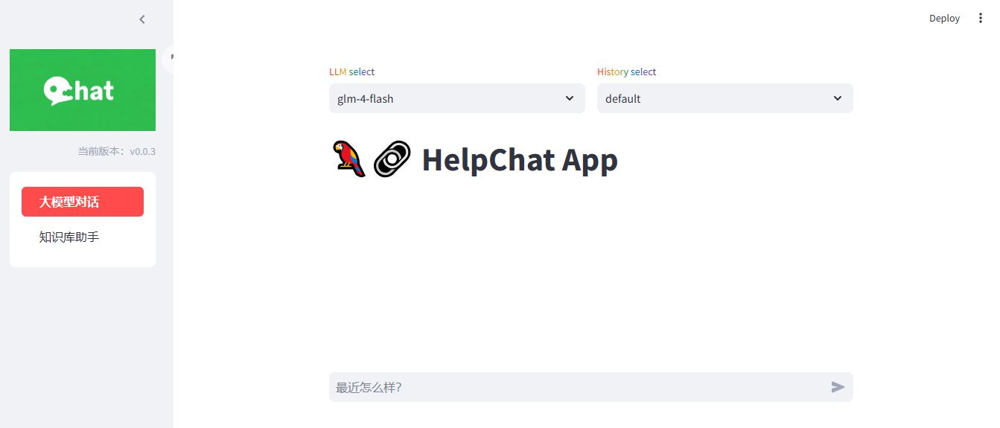
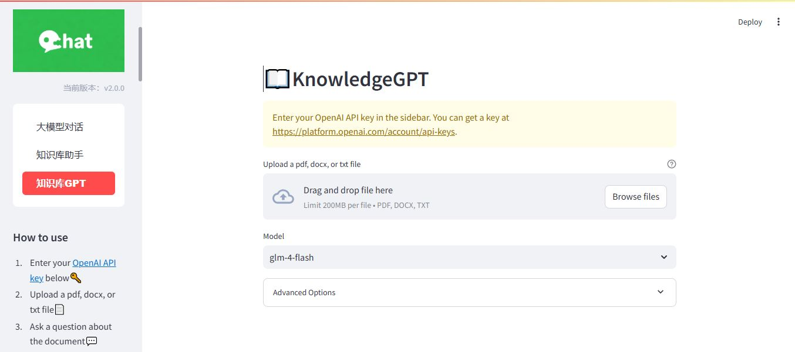
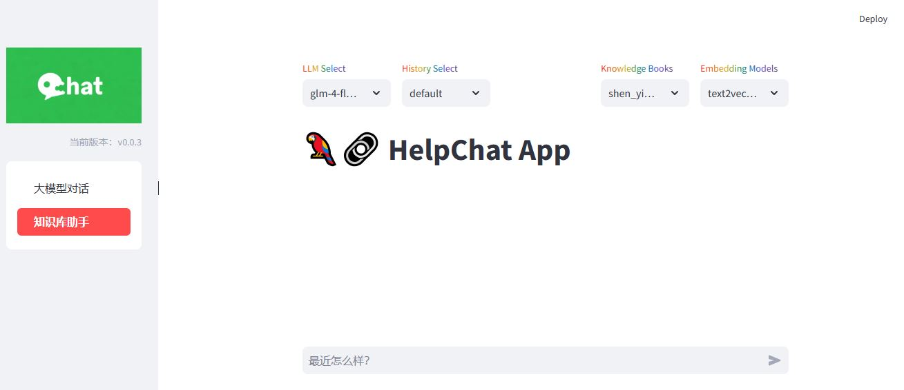

# HelpChat，基于本地知识库的 LLM 实现
## 介绍

🤖️ 利用 [langchain](https://github.com/hwchase17/langchain) 思想实现，基于本地知识库建立一套对中文场景与开源模型支持友好、在线运行的知识库问答解决方案。

💡 受 [Langchain-Chatchat](https://github.com/chatchat-space/Langchain-Chatchat) 、[knowledge_gpt](https://github.com/mmz-001/knowledge_gpt)项目启发，采建立了全流程可使用 LLM 模型实现的本地知识库问答应用。目前支持了智谱-api、通义千问-api 等开源大模型。

🚩 本项目中 Embedding 默认选用的是 [shibing624/text2vec-base-chinese-paraphrase](https://hf-mirror.com/shibing624/text2vec-base-chinese-paraphrase) ，LLM 默认选用的是 [ChatGLM-4-Flash](https://open.bigmodel.cn/console/trialcenter?modelCode=glm-4-flash) 。依托上述模型，本项目可实现使用**开源**模型**离线私有部署**。

🖥️ 本项目主要有以下过程:
- **读取文本** 
    - [X] 读取md文档。
    - [X] 读取txt。
    - [X] 读取pdf文档
        - 使用 PaddleOCR识别文档内容。
    - [X] 读取jpg、png文件
        - 使用 PaddleOCR识别图片内容。
    - [X] 读取其他类型文档。
        - 使用 Langchain 读取其他非结构化文件内容。
- **文本分割**
      - 按照中文常见的分割符分割文本内容。
- **文本向量化**
    - **知识库文件内容向量化**
        - 使用加载向量模型，将doc知识文档内容转为向量存放库中。
    - **问句向量化**
        - 使用向量模型将query也向量化。
- **在文本向量中匹配出与问句向量最相似的`top k`个。**
- **匹配出的文本作为上下文和问题一起添加到`prompt`中。**
- **提交给`LLM`生成回答。**

## 硬件需求

- Embedding 模型硬件需求
  
  本项目中选用的 Embedding 模型 [shibing624/text2vec-base-chinese-paraphrase](https://hf-mirror.com/shibing624/text2vec-base-chinese-paraphrase)可修改为在 CPU 中运行。

## 向量化模型

中文匹配效果

| Arch   | BaseModel                  | Model                                                        | ATEC  | BQ    | LCQMC | PAWSX | STS-B | SOHU-dd | SOHU-dc | Avg   | QPS  |
| ------ | -------------------------- | ------------------------------------------------------------ | ----- | ----- | ----- | ----- | ----- | ------- | ------- | ----- | ---- |
| CoSENT | hfl/chinese-macbert-base   | [shibing624/text2vec-base-chinese](https://hf-mirror.com/shibing624/text2vec-base-chinese) | 31.93 | 42.67 | 70.16 | 17.21 | 79.30 | 70.27   | 50.42   | 51.61 | 3008 |
| CoSENT | hfl/chinese-lert-large     | [GanymedeNil/text2vec-large-chinese](https://hf-mirror.com/GanymedeNil/text2vec-large-chinese) | 32.61 | 44.59 | 69.30 | 14.51 | 79.44 | 73.01   | 59.04   | 53.12 | 2092 |
| CoSENT | nghuyong/ernie-3.0-base-zh | [shibing624/text2vec-base-chinese-paraphrase](https://hf-mirror.com/shibing624/text2vec-base-chinese-paraphrase) | 44.89 | 63.58 | 74.24 | 40.90 | 78.93 | 76.70   | 63.30   | 63.08 | 3066 |


## 开发部署
### 1. web-ui 端启动
执行 [webui-startup.py](frontend/webui-startup.py) 脚本体验**命令行交互**：
```shell
$ python /frontend/webui-startup.py
```







### 2. 后端（知识向量库-数据库）启动

执行 [main_controller.py](backend/main_controller.py) 脚本体验**命令行交互**：

```bash
$ python /backend/main_controller.py
```


## 路线图

- [x] Langchain 应用
    - [x] 接入非结构化文档（已支持 md、pdf、docx、txt 文件格式）
    - [x] jpg 与 png 格式图片的 OCR 文字识别
    - [ ] 搜索引擎接入
    - [ ] 本地网页接入
    - [ ] 结构化数据接入（如 csv、Excel、SQL 等）
    - [ ] 知识图谱/图数据库接入
    - [ ] Agent 实现
    
- [x] 增加更多 LLM 模型支持
  
    - [ ] 本地部署支持
    
        - [ ] [THUDM/chatglm-6b](https://huggingface.co/THUDM/chatglm-6b)
    
        - [ ] [THUDM/chatglm-6b-int4](https://huggingface.co/THUDM/chatglm-6b-int4)
        - [ ] [THUDM/chatglm-6b-int4-qe](https://huggingface.co/THUDM/chatglm-6b-int4-qe)
    
    - [x] API部署支持
    
        - [x] [THUDM/chatglm-4-Flash](https://open.bigmodel.cn/console/trialcenter?modelCode=glm-4-flash)
        - [x] [Qwen/Qwen-plus](https://bailian.console.aliyun.com/?productCode=p_efm#/model-market/detail/qwen-plus)
        - [x] [Qwen/Qwen-tubor](https://bailian.console.aliyun.com/?productCode=p_efm#/model-market/detail/qwen-turbo)
        - [x] [Qwen/Qwen-2-0.5b-instruct](https://bailian.console.aliyun.com/?productCode=p_efm#/model-market/detail/qwen2-0.5b-instruct)
        - [x] [Qwen/Qwen2.5-72B-Instruct](https://www.modelscope.cn/models/Qwen/Qwen2.5-72B-Instruct)
    
- [x] 增加更多 Embedding 模型支持
    - [x] [shibing624/text2vec-base-chinese](https://huggingface.co/shibing624/text2vec-base-chinese)
    - [x] [shibing624/text2vec-base-chinese-paraphrase](https://hf-mirror.com/shibing624/text2vec-base-chinese-paraphrase)
    - [x] [GanymedeNil/text2vec-large-chinese](https://huggingface.co/GanymedeNil/text2vec-large-chinese)
    
- [x] 终端对话
    - [ ] 非流式对话
    - [x] 流式对话
- [ ] Docker容器部署
- [x] Web UI
    - [ ] 基于 gradio 实现 Web UI DEMO
    - [x] 基于 streamlit 实现 Web UI DEMO
    - [ ] 引用标注
    - [ ] 增加知识库管理
        - [x] 选择知识库开始问答
        - [x] 上传文件/文件夹至知识库
        - [x] 知识库测试
    - [ ] 支持搜索引擎问答
    
- [x] 增加 API 支持
    - [x] 利用 fastapi 实现 API 部署方式
    - [x] 实现调用 API 的 Web UI Demo

